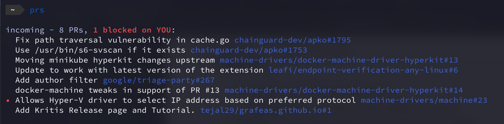

# 🚀 prs

> Only shows PRs waiting on YOU

A fast CLI that filters GitHub PRs to show only what needs your attention. No more digging through dozens of PRs to find the ones that actually need you.

## Quick Start

```bash
go install github.com/ready-to-review/prs@latest
prs
```

**Requirements:** Go 1.23+ and GitHub CLI (`gh`) authenticated

## Usage

```bash
# Show PRs you're involved with (filters out stale PRs)
prs

# Only PRs waiting for your review
prs --blocked

# Include old/stale PRs
prs --include-stale

# Auto-refresh view
prs --watch

# Get notified when PRs need attention
prs --notify
```

## What You'll See

### Default View (`prs`)


### Live Focus Mode (`prs --blocked --watch`)


## Options

- `--blocked` - Only PRs blocking on you
- `--include-stale` - Include old PRs (hidden by default)
- `--watch` - Live updates
- `--notify` - Desktop notifications
- `--org` - Filter to specific organization
- `--debug` - Show debug info

## Status Icons

- 🚧 Draft PR
- ✅ Ready to merge
- 👍 Has approval
- 💥 Merge conflict
- ⏰ Stale PR
- ❌ Failing tests
- 📝 Regular PR

## Why This Tool?

Stop context switching through GitHub tabs. This tool uses smart filtering to show only PRs that actually need your input - not PRs waiting on CI, other reviewers, or ones you've already reviewed.

Built fast in Go because your development tools shouldn't slow you down.
